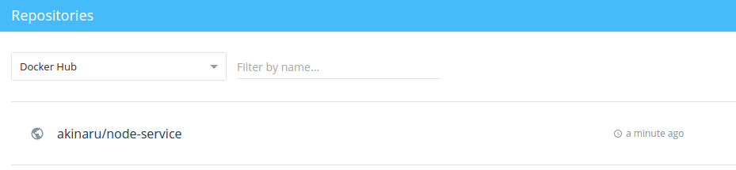
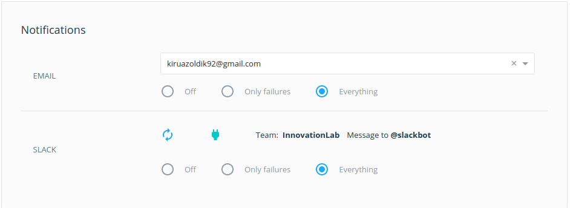

# Node services docker template

A template project to show how to use docker containers to run several services on a host with : 

* docker orchestration with <a href="https://cloud.docker.com/_/dashboard/onboarding">docker-cloud</a>
* log recovery from <a href="https://www.elastic.co/products/logstash">Logstash</a> to <a href="https://www.elastic.co/products/elasticsearch">ElasticSearch</a>

## Build locally

Before running :
* put your ElasticSearch `keystore.jks` in `key` directory
* edit <a href="https://github.com/akinaru/node-docker-template/blob/master/logstash/logstash.conf">logstash configuration file</a> in `logstash` folder to match your ElasticSerarch hostname/port, user, user password and keystore password

You can build all images and run all the services locally using `docker-compose` which use a configuration file `docker-compose.yml` :

```
docker-compose up
```

## Build & Deploy Remotely

You need the <a href="https://docs.docker.com/docker-cloud/installing-cli/">docker cloud CLI</a> to build & deploy docker images to docker-cloud

Before building images, you need to have an <a href="https://cloud.docker.com/_/node/list/1?page_size=10">existing node</a>

* export your docker ID (username)

```
export DOCKER_ID_USER=your_userid
```

* Build docker images of a NodeJS template server :  
```
docker build -t $DOCKER_ID_USER/node-service github.com/akinaru/node-docker-template.git
```

* Push docker images to a new public repository on docker-cloud :
```
docker push $DOCKER_ID_USER/node-service
```



* login on you VM host, add a user in `docker` group :

```
sudo useradd -G docker bobby
```

* place your ElasticSearch keystore file in `/home/bobby/key` on your VM host :

```
bobby:/home/bobby/key# ls
keystore.jks
```

This way, the reference `/home/bobby/keystore.jks` & `/home/bobby/logstash.conf` will be valid in your configuration file

* On your computer, generate `Stackfile.yml` which is a docker-compose-like configuration like of all your services that will be running on your host :


Edit vars.template with your configuration :
```
#docker cloud user id
USER_PATH=

#your docker user on your host
USER_PATH=/home/bobby

#sentry token for nodeJS service crashlytics
SENTRY_TOKEN=

# ElasticSearch server configuration
ES_HOST=
ES_PORT=9200
ES_USER=
ES_PASS=
ES_USESSL=true
ES_KEYSTORE_PATH=/key/keystore.jks
ES_KEYSTORE_PASS=
```

Eventually, generate stackfile :
```
source vars.template
./generate_stack.sh
```

This will give you `stackfile.yml` with absolute path for data volumes which is required by docker cloud

* push your generated `stackfile.yml` :

```
docker-cloud stack create --name node-template-stack -f stackfile.yml
```
will output create stack with `uuid` : `12345678-1234-abcd-f1f11-123456789ab`

* start your newly created stack :

```
docker-cloud stack start <uuid>
```

* list all your stack to see the status :

```
docker-cloud stack ls
```
will give you 

```
bobby$ docker-cloud stack ls
NAME                  UUID      STATUS            DEPLOYED      DESTROYED
node-template-stack   12345678  ▶ Running         12 minutes ago
```

Note that you can update the created stack with :

```
docker-cloud stack update -f stackfile.yml <uuid>
```

and refeploy the services :

```
docker-cloud stack redeploy <uuid>
```

## Features

### Logging

#### Log : NodeJS side

On each of the 3 node services, logs are stored in a `log` directory at the root of each of the project.

`winston` and `morgan` npm modules are used to log any events that are redirected to a rotated log file

```
// an express server
var app = express();

var logger = new winston.Logger({
	transports: [
		new winston.transports.File({
			level: 'info',
			filename: logDirectory + serverName + '.log',
			handleExceptions: true,
			json: true,
			maxsize: 50000000, //50MB
			maxFiles: 1,
			colorize: false
		}),
		new winston.transports.Console({
			level: 'debug',
			handleExceptions: true,
			json: false,
			colorize: true
		})
	],
	exitOnError: false
});

logger.stream = {
	write: function(message, encoding) {
		logger.info(message);
	}
};

// combined predefined format is used to store access logs
app.use(require("morgan")("combined", {
	"stream": logger.stream
}));
```

#### Log : Docker side

A data volume from host machine is shared with the container to make these log file accessible for the `logstash` container : 

| volume      | description |
|-------------|-------------|
| `./log:/app/log`  | path to the log directory where we have service logs |

which mean the log directory `log` is mapped to `/app/log` in the container. Note that the root of each of the 3 services are located in `/app` directory in the docker containers.

Thus, the `./log` directory on the host machine will contain : 
* server1.log
* server2.log
* server3.log

#### Log : Logstash side

Logstash is used to collect and send log to a remote ElasticSearch server (SSL secured). With a single configuration file all logs are retrieved, filtered and recovered on EK server :

```
input {
  file {
    path => "/log/service1.log"
    type => "server1"
    start_position => "beginning"
  }
  file {
    path => "/log/service2.log"
    type => "server2"
    start_position => "beginning"
  }
  file {
    path => "/log/service3.log"
    type => "server3"
    start_position => "beginning"
  }
  file {
    type => "mongodb"
    path => "/var/log/mongodb/mongod.log"
    start_position => "beginning"
  }
}

filter {
    json {
        source => "message"
    }
}

output {
  elasticsearch { 
        hosts => ["${ES_HOST}:${ES_PORT}"] 
        user => "${ES_USER}"
        password => "${ES_PASS}"
        ssl => ${ES_USESSL}
        keystore =>  "${ES_KEYSTORE_PATH}"
        keystore_password =>  "${ES_KEYSTORE_PASS}"
  }
}
```

`logstash` is another docker container which is mapped with several data volumes :

| volume      | description |
|-------------|-------------|
| `./key:/key`  | path to the local keystore stored on the host machine |
| `./log:/log`  | path to the log directory where we have all services logs |
| `./mongodb/log:/mongodb/log` | path to the mongodb log directory |

### Notifications

Get notified when docker container status change. There is also a <a href="https://slack.com/">Slack</a> integration



### External Links

* https://stackfiles.io/registry : a collection of stackfile 