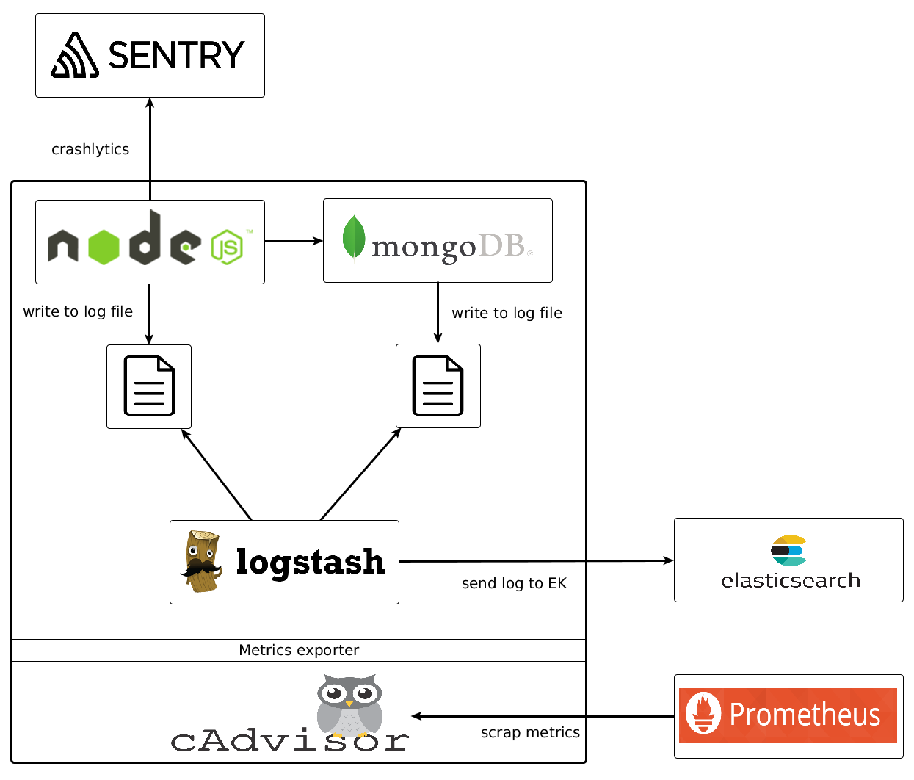

# NodeJS service docker template

[](https://travis-ci.org/bertrandmartel/node-docker-template)
[](https://microbadger.com/images/bertrandmartel/node-docker-template)
[](https://microbadger.com/images/bertrandmartel/node-docker-template)

A dockerized NodeJS server template connected to a mongodb service with log export via logstash 



Check <a href="https://github.com/bertrandmartel/docker-monitoring">docker-monitoring</a> for log & metrics platform architecture & docker-dompose configuration.

## Build

Edit your own configuration in `vars-template` :

```
source vars-template
./sourcing.sh
```

ElasticSearch https configuration require : 
* a `keystore.jks` in `key` directory

### docker-compose 

```
docker-compose up
```

### docker-cloud

```
docker-cloud stack create --name node-service -f stackfile.yml
docker-cloud stack start node-service
```
